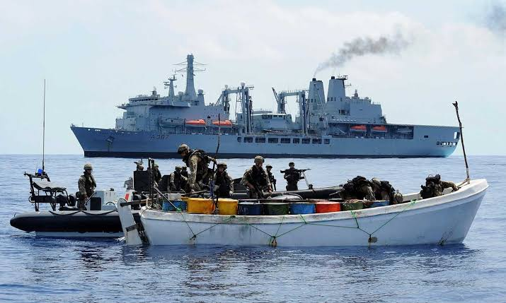
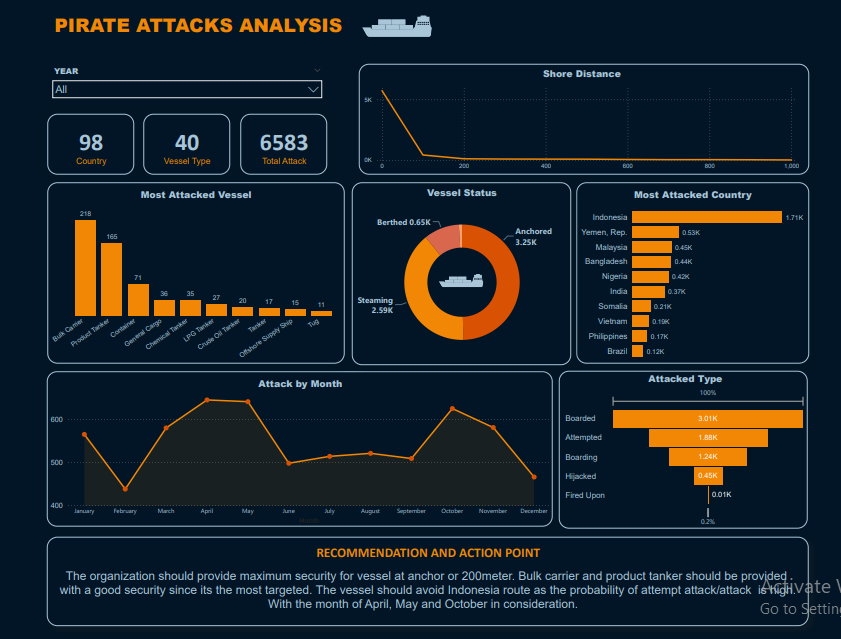

# Comprehensive Analysis of Maritime Piracy Incidents

  

## Introduction
The maritime industry plays a critical role in global trade, but it faces significant challenges due to piracy threats that endanger cargo, crew, and vessel safety. This research aims to provide a comprehensive overview of ship piracy occurrences, focusing on trends, affected areas, and essential insights for stakeholders within the maritime sector.

## Data Sources and Methodology

This analysis relies on data from the International Maritime Bureau (IMB) Piracy Reporting Centre, sourced from Kaggle. The dataset spans from 1994 to 2020 and encompasses reported incidents of ship piracy worldwide. Data cleaning was conducted to ensure data consistency and accuracy.

### Overview of Ship Piracy Incidents
During the study period, a total of 7,511 ship piracy incidents were reported. Following data cleaning, 6,584 cases were retained for analysis.

### Geographical Distribution
The data reveals that ship piracy incidents were heavily concentrated in specific regions, with Indonesia emerging as a prominent hotspot. This underscores the urgent need for bolstered security measures in these vulnerable areas.

## Types of Attacks:

The analysis categorizes ship piracy incidents into the following types:

**Hijacked :** Pirates boarded and forcibly took control of a vessel.

**Boarded:** A successful boarding whether control of the vessel was achieved or not

**Boarding:** Attempts to counter the ships defences and Ship Protection Measures by use of ladders, grappling hooks and weapons deliberately used against the vessel.

**Attempted:** Attempt to board a vessel (where it is suspected that the assailants are pirates)

Boarded: 45.82%

Attempted: 28.56%

Boarding: 18.77%

Hijacked: 6.76%

The most prevalent type of attack was **BOARDED** accounting for 45.82% of the total incidents.

## Time and Seasonality

An examination of the chronological aspects of ship piracy incidents yielded the following trends:
- April, May, and October experienced the highest number of incidents, suggesting potential seasonality in pirate activities.
- Attacks were more frequent on Wednesdays, indicating specific preferred times of day for pirate activity.

## Key Insights and Recommendations

**Enhanced Security Measures:**
Given the concentration of piracy incidents in specific regions, maritime stakeholders should prioritize the implementation of robust security measures, including:
- Increased maritime patrols and continuous surveillance in piracy-prone areas.
- Comprehensive training programs for crew members in self-defense techniques, response procedures, and piracy awareness.
- Adoption of vessel hardening techniques, such as secure access points, reinforced citadels, and effective communication systems.

**Data Sharing and Analysis:**
To analyze evolving trends, identify vulnerabilities, and devise effective solutions, ongoing data collection and analysis are paramount. Encouraging cross-industry collaboration in sharing piracy incident data can provide valuable insights and support the development of targeted initiatives.

# Conclusion

Ship piracy remains a pressing concern for the maritime industry, necessitating proactive measures to ensure the safety and security of vessels, crews, and cargo. By leveraging data analysis and implementing comprehensive security measures, the industry can mitigate risks and safeguard against pirate attacks.

## Dashboard

  

